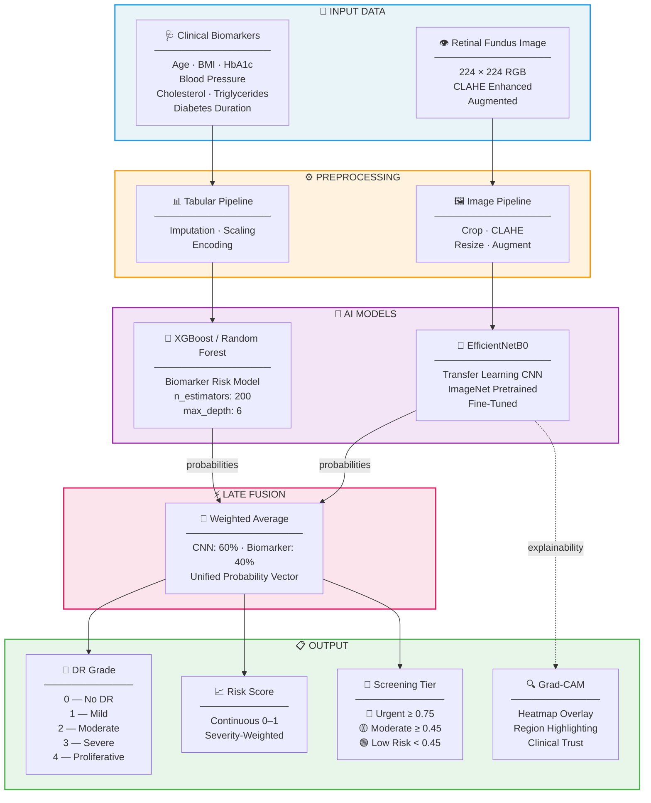

# Diabetic Retinopathy Early Detection — Unified AI System

An AI-powered system for the early detection and severity grading of **Diabetic Retinopathy (DR)** by combining clinical biomarker analysis with deep learning–based retinal image classification.

---

## Objectives

1. **Biomarker-based risk prediction** — XGBoost/Random Forest model on clinical data (HbA1c, blood pressure, cholesterol, etc.)
2. **CNN-based retinal image classification** — Transfer learning (EfficientNet/ResNet) on fundus photographs
3. **Improved early detection** — Late fusion of both models into a unified risk score
4. **Interpretability** — Grad-CAM heatmaps highlighting diagnostically relevant retinal regions
5. **Screening prioritization** — Automatic triage into Urgent / Moderate / Low Risk tiers

## Architecture



## DR Severity Grades

| Grade | Label             | Description                          |
|-------|-------------------|--------------------------------------|
| 0     | No DR             | No visible signs of retinopathy      |
| 1     | Mild NPDR         | Microaneurysms only                  |
| 2     | Moderate NPDR     | More than just microaneurysms        |
| 3     | Severe NPDR       | Extensive intraretinal abnormalities |
| 4     | Proliferative DR  | Neovascularization / vitreous hemorrhage |

## Project Structure

```
├── data/                       # Local data (not committed)
│   ├── raw/                    # Original images & clinical CSVs
│   ├── processed/              # Cleaned data & augmented images
│   └── sample_inputs/          # Quick-test samples
├── notebooks/                  # Jupyter notebooks
│   ├── 01_eda_biomarkers.ipynb
│   ├── 02_eda_images.ipynb
│   ├── 03_cnn_prototyping.ipynb
│   └── 04_gradcam_tests.ipynb
├── src/                        # Source code
│   ├── config/settings.yaml    # Hyperparameters & paths
│   ├── data_prep/              # Image & tabular preprocessing
│   ├── models/                 # Biomarker RF, CNN, Late Fusion
│   ├── explainability/         # Grad-CAM
│   └── pipeline/               # train.py, evaluate.py
├── saved_models/               # Trained model weights
├── api/                        # FastAPI backend
│   ├── main.py                 # API endpoints
│   ├── schemas.py              # Pydantic request/response models
│   └── prioritization.py       # Risk → screening tier mapping
├── requirements.txt
└── README.md
```

## Setup

```bash
# 1. Clone the repository
git clone https://github.com/ChandanHegde24/Early-detection-of-DR.git
cd Early-detection-of-DR

# 2. Create a virtual environment
python -m venv venv
venv\Scripts\activate          # Windows
# source venv/bin/activate     # Linux/Mac

# 3. Install dependencies
pip install -r requirements.txt

# 4. Place your data
#    - Clinical CSV → data/raw/clinical_data.csv
#    - Fundus images → data/raw/images/
#    - Image labels  → data/raw/image_labels.csv (columns: filename, label)
```

## Usage

### Training

```bash
# Train both models (biomarker + CNN)
python -m src.pipeline.train

# Or train individually
python -c "from src.pipeline.train import train_biomarker_pipeline; train_biomarker_pipeline()"
python -c "from src.pipeline.train import train_cnn_pipeline; train_cnn_pipeline()"
```

### Evaluation

```bash
# Run full evaluation (accuracy, F1, ROC-AUC, confusion matrices)
python -m src.pipeline.evaluate
```

### API Server

```bash
# Start the FastAPI server
uvicorn api.main:app --reload --port 8000

# Endpoints:
#   GET  /health              — Health check
#   POST /predict/biomarker   — Predict from clinical data only
#   POST /predict/image       — Predict from retinal image only
#   POST /predict/unified     — Predict from both (late fusion)
```

### API Example

```bash
# Biomarker-only prediction
curl -X POST http://localhost:8000/predict/biomarker \
  -H "Content-Type: application/json" \
  -d '{
    "biomarkers": {
      "age": 58, "bmi": 28.5, "hba1c": 8.2,
      "blood_pressure_systolic": 145, "blood_pressure_diastolic": 92,
      "cholesterol_total": 240, "cholesterol_hdl": 42,
      "cholesterol_ldl": 160, "triglycerides": 200,
      "diabetes_duration_years": 12,
      "smoking_status": 1, "family_history_dr": 1
    }
  }'
```

## Configuration

All hyperparameters are in `src/config/settings.yaml`:

| Parameter | Default | Description |
|-----------|---------|-------------|
| CNN backbone | EfficientNetB0 | Transfer learning base model |
| Image size | 224×224 | Input resolution |
| Batch size | 32 | Training batch size |
| Learning rate | 0.0001 | Initial Adam LR |
| Fusion weights | CNN 0.6 / Bio 0.4 | Late fusion balance |
| Urgent threshold | ≥ 0.75 | Risk score for urgent referral |

## Technologies

- **Deep Learning**: TensorFlow / Keras
- **Machine Learning**: XGBoost, scikit-learn
- **Image Processing**: OpenCV, Albumentations
- **API**: FastAPI, Pydantic
- **Explainability**: Grad-CAM
- **Visualization**: Matplotlib, Seaborn

## License

This project is for educational and research purposes.
